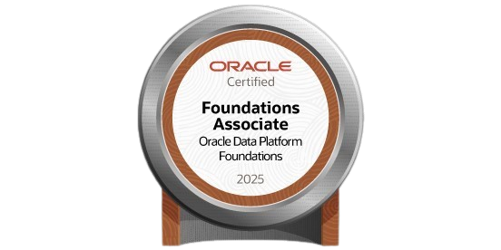
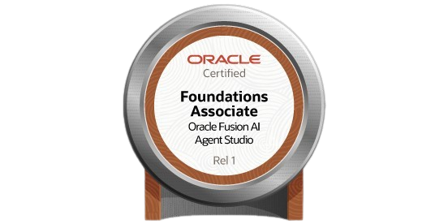
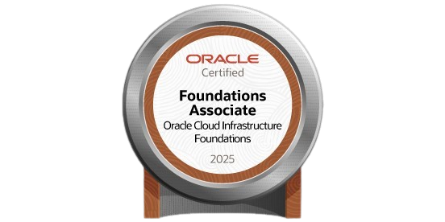
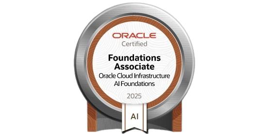

# 👋 Hello! I'm Samuel Henrique Lima da Silva

🎓 **Control and Automation Engineer – UFU**  
📊 **Data Analyst | BI & SQL & ETL | Python | Power Platform**  
🚀 **Focused on transforming data into decisions, automation into efficiency, and AI into business value.**  
📍 **Uberlândia – MG | Brazil**

## 💡 About Me

I am a professional who combines engineering, data, automation, and artificial intelligence to create real, scalable, and impact-driven solutions.  
I work on building dashboards, data pipelines, automated workflows, analytical models, and system integrations — always aiming to improve processes, reduce rework, and support decision-making with reliable data.

I have hands-on experience both in critical industrial environments and in tech startups, which gave me business awareness, agility, and the ability to deliver consistent results.

## 🚀 What I Do

✔️ **Exploratory analysis, data modeling, and transformation**  
✔️ **Dashboard and KPI development (Power BI, Looker Studio)**  
✔️ **ETL development and automation (Python, APIs, Power Automate)**  
✔️ **Systems, databases, and pipeline integrations**  
✔️ **Practical AI applications for productivity, insights, and optimization**  
✔️ **Internal app development with Power Apps**  
✔️ **Technical documentation and results communication**

## 🛠 Tech Stack

### **Programming & Data**
- **Python** (Pandas, NumPy, Requests, Matplotlib, Plotly)  
- **SQL** (data modeling, queries, normalization)  
- **APIs, ETL, and automation**

### **Business Intelligence**
- **Power BI** (DAX, Power Query)  
- **Looker Studio**  
- **Data storytelling and KPI design**

### **Automation & Integrations**
- **Power Automate**  
- **Power Apps**  
- **RPA**  
- **Git and version control**  
- **Advanced Excel**

### **Cloud & Infrastructure**
- **Oracle Cloud OCI**  
- **Supabase / Neon**  
- **Basic CI/CD**

## 🧪 Practical Experience

### 🔹 Data Analytics – Cargill (Industrial / On-Site)

Development of operational dashboards, industrial efficiency analyses, workflow automation, and digitization of critical processes using Power Platform.

**Key Deliveries:**
- Dashboards for boilers, chemicals, waste, and performance  
- Operational apps for checklists, inventory, and equipment registration  
- Automated reporting and KPI consolidation  
- Monthly data presentations to leadership

### 🔹 Researcher – LASEC / UFU (Automation & Robotics)

Mathematical modeling, simulation, and inverse kinematics applied to industrial robots (UR5), using Python, MATLAB, CoppeliaSim, and Three.js.

**Projects:**
- Forward and inverse kinematics using numerical methods  
- 3D simulation and computational validation  
- Technical documentation in LaTeX

### 🔹 eSolvere Tecnologia – Automation & Data

Hybrid work involving hardware, software, and data.

**Activities:**
- Monitoring of OEE, MTBF, and MTTR  
- Performance dashboards  
- Integrations and automatic data collection  
- Support for industrial digitalization

## 🏅 Certifications (Oracle + Alura)

  
  
  
  

50+ certifications, including:

- **Oracle Cloud**  
- **Applied AI for Data**  
- **Python Data Visualization**  
- **SQL & Data Modeling**  
- **Power BI & Analytics**

## 📊 Projects (Data, BI & Automation)

- Full industrial efficiency dashboards (**Power BI**)  
- Workflow automation with **Power Automate**  
- Data pipelines and API integrations  
- Operational applications using **Power Apps**  
- Dashboards with **Python** (Matplotlib, Plotly)  
- 3D simulation and robotics using **Python + CoppeliaSim**  
- Web applications for portfolio using **Python / JS**

📌 **Full portfolio:** https://meu-portifolio-t6rv.onrender.com/

## 🤝 Let's Connect

🔗 **LinkedIn:** https://www.linkedin.com/in/samuel-henrique-lima-da-silva  
🌐 **Portfolio:** https://meu-portifolio-t6rv.onrender.com/  
✉️ **Email:** samuelhenrique10@hotmail.com
